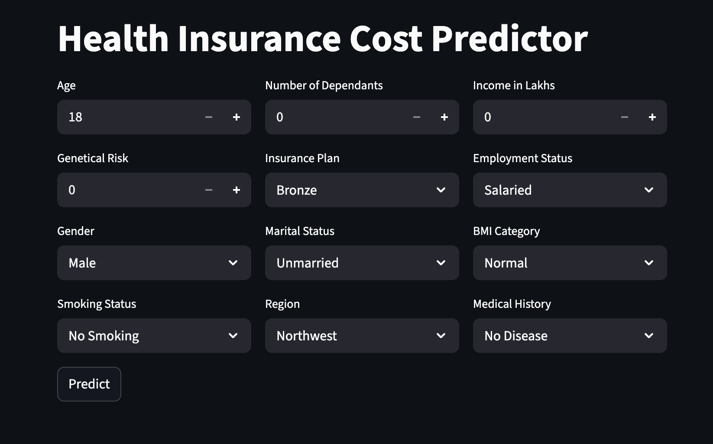
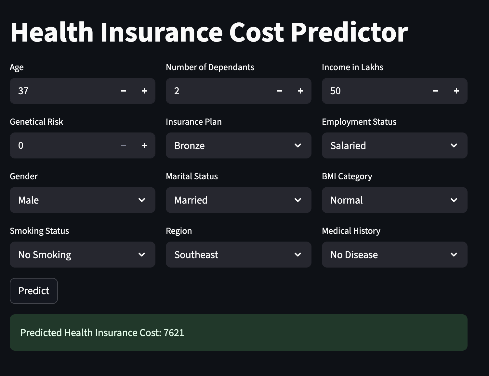

{
 "cells": [
  {
   "cell_type": "markdown",
   "id": "982eb254-8f6f-4730-a08e-34ee946549e9",
   "metadata": {},
   "source": [
    "# ML_Project_Premium_Prediction\n",
    "**Codebasics ML Course – Health Insurance Premium Prediction Project**\n",
    "\n",
    "---\n",
    "\n",
    "## 📘 Project Overview\n",
    "This project aims to build a Machine Learning model to predict insurance premium amounts based on historical data and relevant features.  \n",
    "The model includes data preprocessing, feature engineering, and predictive modeling techniques for accurate predictions.\n",
    "\n",
    "---\n",
    "\n",
    "## ✨ Features\n",
    "- Data Cleaning and Preprocessing\n",
    "- Exploratory Data Analysis (EDA) with visualizations\n",
    "- Feature Engineering for improved model performance\n",
    "- Model Training using regression algorithms (Linear Regression, Random Forest, XGBoost, etc.)\n",
    "- Model Evaluation using metrics like RMSE, MAE, and R²\n",
    "- Model Export for deployment and integration\n",
    "\n",
    "---\n",
    "\n",
    "## 📊 Dataset\n",
    "- **Source:** (Mention dataset source, e.g., Kaggle, UCI, or internal)  \n",
    "- **Description:** The dataset contains customer information and factors affecting premium calculation, including:  \n",
    "  - Age  \n",
    "  - Gender  \n",
    "  - Vehicle type  \n",
    "  - Claim history  \n",
    "  - Other relevant features  \n",
    "\n",
    "---\n",
    "\n",
    "## 🚀 Getting Started\n",
    "\n",
    "### 1️⃣ Clone the repository\n",
    "```bash"
   ]
  },
  {
   "cell_type": "code",
   "execution_count": null,
   "id": "17d308fa-5c77-4699-9174-8f05cf04d540",
   "metadata": {},
   "outputs": [],
   "source": [
    "git clone https://github.com/your-username/ML_Project_Premium_Prediction.git"
   ]
  },
  {
   "cell_type": "markdown",
   "id": "27d18056-591e-44c9-87c2-f6fabfbd5c68",
   "metadata": {},
   "source": [
    "### 2️⃣ Install required Python libraries\n",
    "```bash"
   ]
  },
  {
   "cell_type": "code",
   "execution_count": null,
   "id": "60d858f6-0a90-48ea-a895-354741fd472e",
   "metadata": {},
   "outputs": [],
   "source": [
    "pip install -r requirements.txt"
   ]
  },
  {
   "cell_type": "markdown",
   "id": "14b42b25-cbae-40d8-a1ec-10811e292f87",
   "metadata": {},
   "source": [
    "The trained models are stored in the artifacts"
   ]
  },
  {
   "cell_type": "raw",
   "id": "066c7726-0b8a-4677-8927-bf1de7a7bd76",
   "metadata": {},
   "source": [
    "## 📁 File Structure \n",
    "ML_Project_Premium_Prediction/\n",
    "│\n",
    "├── artifacts/             # Saved model files\n",
    "├── notebooks/             # Jupyter notebooks for EDA and experiments\n",
    "├── src/                   # Python scripts for preprocessing, training, and prediction\n",
    "├── requirements.txt       # Python dependencies\n",
    "├── README.md              # Project documentation"
   ]
  },
  {
   "cell_type": "markdown",
   "id": "5cb2e2f6-6c02-4e25-b93e-50d1a2e16e5c",
   "metadata": {},
   "source": [
    "## ▶️ Run the Streamlit App "
   ]
  },
  {
   "cell_type": "code",
   "execution_count": null,
   "id": "be48669f-4769-42e5-85a0-2fc45e4cb55c",
   "metadata": {},
   "outputs": [],
   "source": [
    "streamlit run main.py"
   ]
  },
  {
   "cell_type": "markdown",
   "id": "9a7887c7-d3ca-4729-beed-671b2e74390c",
   "metadata": {},
   "source": []
  },
  {
   "cell_type": "markdown",
   "id": "bf1d4d08-402b-44f8-a85a-f9634508f565",
   "metadata": {},
   "source": [
    "## 📸 Screenshots\n",
    "\n",
    "### Dashboard View\n",
    "\n",
    "\n",
    "### Model Results\n",
    ""
   ]
  },
  {
   "cell_type": "code",
   "execution_count": null,
   "id": "f04a6ec7-4828-44fe-adf3-5b3ebac3e653",
   "metadata": {},
   "outputs": [],
   "source": []
  }
 ],
 "metadata": {
  "kernelspec": {
   "display_name": "Python 3 (ipykernel)",
   "language": "python",
   "name": "python3"
  },
  "language_info": {
   "codemirror_mode": {
    "name": "ipython",
    "version": 3
   },
   "file_extension": ".py",
   "mimetype": "text/x-python",
   "name": "python",
   "nbconvert_exporter": "python",
   "pygments_lexer": "ipython3",
   "version": "3.12.2"
  }
 },
 "nbformat": 4,
 "nbformat_minor": 5
}
